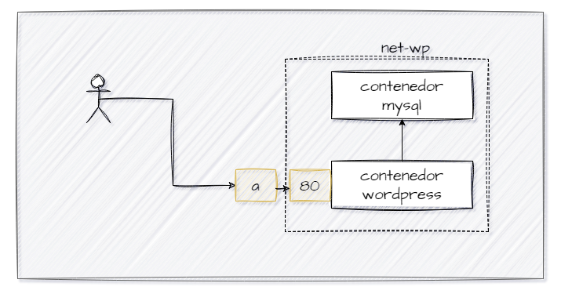

## Esquema para el ejercicio


### Crear la red
```
docker network create net-wp
```


### Crear el contenedor mysql a partir de la imagen mysql:8, configurar las variables de entorno necesarias
```
docker run --name contenedor_mysql --network net-wp -e MYSQL_ROOT_PASSWORD=root_password -e MYSQL_DATABASE=wordpress -e MYSQL_USER=wp_user -e MYSQL_PASSWORD=wp_password -d mysql:8
```

### Crear el contenedor wordpress a partir de la imagen: wordpress, configurar las variables de entorno necesarias
```
docker run --name contenedor_wordpress --network net-wp -e WORDPRESS_DB_HOST=contenedor_mysql:3306 -e WORDPRESS_DB_NAME=wordpress -e WORDPRESS_DB_USER=wp_user -e WORDPRESS_DB_PASSWORD=wp_password -p 9300:80 -d wordpress
```
De acuerdo con el trabajo realizado, en la el esquema de ejercicio el puerto a es **9300**

Ingresar desde el navegador al wordpress y finalizar la configuración de instalación.


Desde el panel de admin: cambiar el tema y crear una nueva publicación.
Ingresar a: http://localhost:9300/ 
recordar que a es el puerto que usó para el mapeo con wordpress


### Eliminar el contenedor wordpress
```
docker stop contenedor_wordpress
```
```
docker rm contenedor_wordpress
```

### Crear nuevamente el contenedor wordpress
Ingresar a: http://localhost:9300/ 
recordar que a es el puerto que usó para el mapeo con wordpress

### ¿Qué ha sucedido, qué puede observar?

Los datos de la configuración y el contenido de WordPress se han mantenido debido a la persistencia de los datos en la base de datos MySQL.


