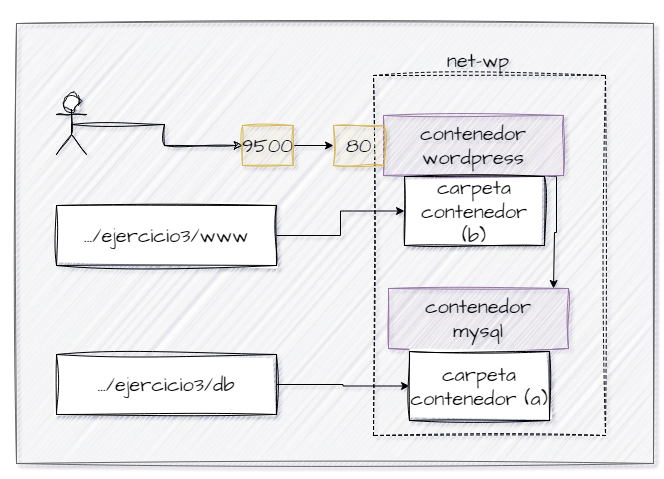

## Esquema para el ejercicio


### Crear red net-wp
```
docker network create net-wp
```

### Para que persista la información es necesario conocer en dónde mysql almacena la información.
# COMPLETAR LA SIGUIENTE ORACIÓN. REVISAR LA DOCUMENTACIÓN DE LA IMAGEN EN https://hub.docker.com/)
En el esquema del ejercicio la carpeta contenedor (a) es (COMPLETAR CON LA RUTA)
Ruta carpeta host: .../ejercicio3/db

### ¿Qué contiene la carpeta db del host?
Inicialmente, la carpeta db del host está vacía.

### Crear un contenedor con la imagen mysql:8  en la red net-wp, configurar las variables de entorno: MYSQL_ROOT_PASSWORD, MYSQL_DATABASE, MYSQL_USER y MYSQL_PASSWORD
```
docker run -d --name mysql_container --network net-wp \
  -v /path/to/ejercicio3/db:/var/lib/mysql \
  -e MYSQL_ROOT_PASSWORD=root_password \
  -e MYSQL_DATABASE=wordpress_db \
  -e MYSQL_USER=wordpress_user \
  -e MYSQL_PASSWORD=wordpress_password \
  mysql:8
```

### ¿Qué observa en la carpeta db que se encontraba inicialmente vacía?
La carpeta db ahora contiene los archivos y directorios de la base de datos MySQL, incluyendo archivos de datos, logs, y configuraciones de MySQL.

### Para que persista la información es necesario conocer en dónde wordpress almacena la información.
# COMPLETAR LA SIGUIENTE ORACIÓN. REVISAR LA DOCUMENTACIÓN DE LA IMAGEN EN https://hub.docker.com/)
En el esquema del ejercicio la carpeta contenedor (b) es (COMPLETAR CON LA RUTA)
Ruta carpeta host: .../ejercicio3/www

### Crear un contenedor con la imagen wordpress en la red net-wp, configurar las variables de entorno WORDPRESS_DB_HOST, WORDPRESS_DB_USER, WORDPRESS_DB_PASSWORD y WORDPRESS_DB_NAME (los valores de estas variables corresponden a los del contenedor creado previamente)
```
docker run -d --name wordpress_container --network net-wp \
  -v /path/to/ejercicio3/www:/var/www/html \
  -e WORDPRESS_DB_HOST=mysql_container:3306 \
  -e WORDPRESS_DB_USER=wordpress_user \
  -e WORDPRESS_DB_PASSWORD=wordpress_password \
  -e WORDPRESS_DB_NAME=wordpress_db \
  -p 9500:80 \
  wordpress
```

### Personalizar la apariencia de wordpress y agregar una entrada

### Eliminar el contenedor y crearlo nuevamente, ¿qué ha sucedido?
```
docker rm -f wordpress_container
```
Al eliminar y crear nuevamente el contenedor, la personalización de la apariencia y las entradas agregadas persisten porque los datos de WordPress se almacenan en la carpeta del host .../ejercicio3/www y en la base de datos MySQL en .../ejercicio3/db.


